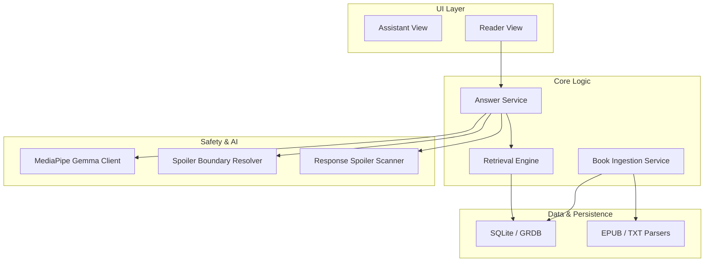
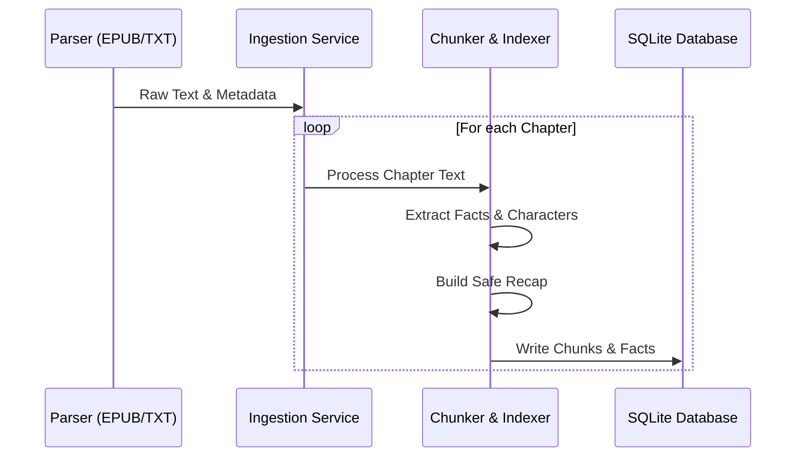
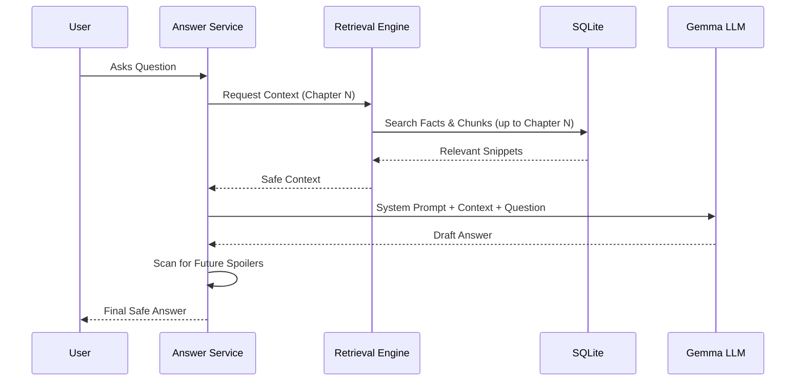

# AI-Reader (BookMind) 📚🧠

AI-Reader is a sophisticated iOS application designed to transform the reading experience by integrating an on-device Large Language Model (LLM). It allows readers to ask questions about the book they are currently reading, providing intelligent answers while strictly adhering to "spoiler boundaries"—ensuring that no information from future chapters is leaked.

## ✨ Features

- **On-Device LLM**: Powered by MediaPipe Gemma, ensuring privacy and offline availability.
- **Smart Context Retrieval**: Uses SQLite FTS5 for fast, relevant context extraction.
- **Spoiler Safety**: A multi-layered safety system that prevents the LLM from mentioning events beyond the user's current reading progress.
- **Deep Book Ingestion**: Automatically chunks text, extracts facts, builds chapter recaps, and detects characters during import.
- **Supports Multiple Formats**: Parsing for EPUB and TXT files.

## 🏗️ Architecture

The project follows a modular architecture to separate concerns between parsing, persistence, retrieval, and AI inference.

### High-Level System Overview



### 📥 Ingestion Flow
When a book is imported, the system processes it to create a "Book Memory" for the AI.



### 🧠 Retrieval & Answer Flow
When a user asks a question, the system retrieves only safe context based on the current chapter.



## 📦 Project Structure

- **`ReaderCore`**: Core parsing logic for digital books.
- **`BookMemory`**: Handles the ingestion process, including character detection and fact extraction.
- **`Persistence`**: Robust data layer built on top of GRDB and SQLite.
- **`Retrieval`**: The engine responsible for finding relevant context for user queries.
- **`LLM`**: Integration with MediaPipe and Gemma for on-device inference.
- **`Safety`**: Logic to enforce spoiler boundaries and scan responses.
- **`SharedModels`**: Common data structures used throughout the app.

## 🚀 Getting Started

### Prerequisites
- Xcode 15.3+
- iOS 17.0+
- MediaPipe Gemma weights (must be added to the project bundle)

### Installation
1. Clone the repository:
   ```bash
   git clone https://github.com/Totsamuychel/AI-Reader.git
   ```
2. Open `ios-bookmind/Package.swift` in Xcode or open the project folder.
3. Ensure dependencies are resolved via Swift Package Manager.
4. Build and run on a physical device (recommended for LLM performance).

## 📄 License
This project is licensed under the MIT License - see the LICENSE file for details.
